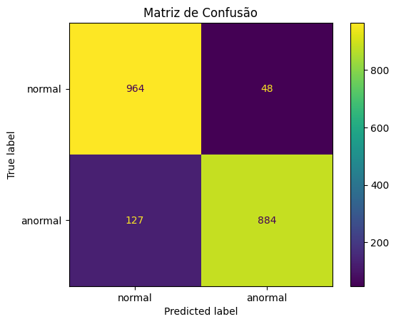

# FIAP - Faculdade de Informática e Administração Paulista

<p align="center">
  <a href="https://www.fiap.com.br/">
    
  </a>
</p>

<br>


## Grupo 34

## 👨‍🎓 Integrantes: 
- <a href="https://www.linkedin.com/in/vittor-augusto/">Vitor Augusto Gomes</a>
- <a href="https://www.linkedin.com/in/jo%C3%A3o-vitor-lopes-beiro-59a007248/">João Vitor Lopes Beiro</a>

## 👩‍🏫 Professores:
### Tutor(a) 
- <a href="https://www.linkedin.com/in/leonardoorabona/">Leonardo Ruiz Orabona</a>
### Coordenador(a)
- <a href="https://www.linkedin.com/in/profandregodoi/">André Godoi Chiovato</a>


## 📜 Descrição

# 🫀 CardioIA – Fase 2: Ir Além 1 – Interface do CardioIA

O objetivo é construir a interface do **CardioIA** em **React + Vite**, simulando um portal de cardiologia com autenticação fake, listagem de pacientes, agendamento de consultas e um dashboard com métricas.

---

## 📌 Funcionalidades

- 🔑 **Autenticação simulada** via Context API (login fake, armazenado em estado).
- 👨‍⚕️ **Listagem de pacientes** consumindo dados de uma API fake (JSONPlaceholder).
- 📅 **Formulário de agendamento de consultas** usando `useState` e `useReducer`.
- 📊 **Dashboard simples** com:
  - Número total de pacientes.
  - Número total de consultas agendadas.
  - Gráfico ilustrativo com **Recharts**.
- 🔒 **Proteção de rotas**: apenas usuários logados conseguem acessar pacientes, agendamentos e dashboard.
- 🎨 **Estilização responsiva** utilizando CSS Modules.

---

## 🚀 Como executar o projeto

1️. **Clonar o repositório**

```bash
git clone https://github.com/vittorgustto/cardioia-fase2.git
cd cardioia-fase2/ir-alem1-frontend

ou faça o download do notebook rede_neural_ecg.ipynb e do arquivo kaggle.json e...
```

2. **Instalar as dependências**
```
npm install
```

3. **Instalar a biblioteca de gráficos (Recharts)**
```
npm install recharts
```

4. **Rodar a aplicação**
```
npm run dev
```

A aplicação estará disponível em:
👉 http://localhost:5173

---

## 🧪 Login Simulado

Para acessar o portal, use qualquer e-mail e senha no login.
Exemplo:

```
email: teste@teste.com
senha: 123456
```

---

## ▶️ Demonstração em Vídeo

📹 [Clique aqui para assistir no YouTube](COLOQUE_AQUI_O_LINK_NAO_LISTADO)  

---

## 📑 Observações

Este projeto não possui back-end real. Todos os dados são simulados via JSONPlaceholder e estados internos do React. O objetivo é demonstrar boas práticas de Front-End:


  - Componentização
  - Hooks (useState, useEffect, useContext, useReducer)
  - Context API
  - Roteamento protegido

---

## 📂 Estrutura de Pastas

```
ir-alem1-frontend/
├── public/
├── src/
│ ├── components/ # Componentes reutilizáveis
│ ├── contexts/ # AuthContext e PatientsContext
│ ├── pages/ # Login, Dashboard, Patients, Schedule
│ ├── services/ # Serviços (API fake)
│ ├── App.jsx # Roteamento e Context Providers
│ └── main.jsx # Ponto de entrada
├── package.json
└── vite.config.js
```

---

# 🫀 CardioIA – Fase 2: Ir Além 2 – Diagnóstico visual em cardiologia com MLP

Este projeto aplica uma **Rede Neural Artificial (MLP – Perceptron Multicamadas)** para classificar imagens médicas de **eletrocardiogramas (ECG)** em **normal** ou **anormal**.  

Ele faz parte do desafio *CardioIA*, ampliando o uso da Inteligência Artificial para diagnósticos visuais e reforçando o papel da IA no apoio à decisão médica.

---

## 📊 Dataset

- **Fonte:** [Kaggle – Heartbeat Dataset](https://www.kaggle.com/datasets/shayanfazeli/heartbeat)  
- Classes:  
  - **Normal** → ECGs saudáveis  
  - **Anormal** → ECGs com irregularidades  

O dataset foi balanceado para conter o mesmo número de amostras normais e anormais.

---

## ⚙️ Etapas do Projeto

1. **Pré-processamento das imagens**
   - Conversão para tons de cinza
   - Redimensionamento para 128x128 pixels
   - Normalização para valores entre 0 e 1  

2. **Construção do modelo MLP (Keras)**
   - Camada de entrada (Flatten)  
   - Camadas densas ocultas com ReLU e Dropout  
   - Camada de saída com ativação Sigmoid  

3. **Treinamento**
   - Função de perda: `binary_crossentropy`  
   - Otimizador: `adam`  
   - Early Stopping para evitar overfitting  

4. **Avaliação**
   - Métricas: Acurácia, Precisão, Recall, F1-score  
   - Matriz de confusão  

---

## 🚀 Como Executar

1. Clone este repositório:
   ```bash
   git clone https://github.com/SEU_USUARIO/Ir-Alem-2-ECG-MLP.git

   ou faça o download do notebook rede_neural_ecg.ipynb e do arquivo kaggle.json e...
   
2. Abra o notebook no Google Colab ou Jupyter.

3. Faça upload do arquivo kaggle.json na seção "Arquivos" do Colab

4. Execute todas as células na ordem.

---

## 📈 Resultados

- **Acurácia no conjunto de teste:** ~91%  
- **Relatório de classificação:**

```
          precision    recall  f1-score   support

  normal       0.88      0.95      0.92      1012
 anormal       0.95      0.87      0.91      1011

accuracy                           0.91      2023
macro avg      0.92      0.91      0.91      2023
weighted avg   0.92      0.91      0.91      2023

```

**Matriz de Confusão:**

|               | Pred Normal | Pred Anormal |
|---------------|-------------|--------------|
| **True Normal**   | 964         | 48           |
| **True Anormal**  | 127         | 884          |




---

## ▶️ Demonstração em Vídeo

📹 [Clique aqui para assistir no YouTube](COLOQUE_AQUI_O_LINK_NAO_LISTADO)  

---

## 🏆 Conclusão

O modelo MLP foi capaz de alcançar 91% de acurácia, mostrando que mesmo arquiteturas simples podem apoiar tarefas de triagem médica em ECGs.

Este resultado reforça a importância da IA na área da saúde, auxiliando profissionais na detecção precoce de anomalias cardíacas.

---

## Estrutura do Repositório

```
├── rede_neural_ecg.ipynb # Notebook com todo o código
├── exemplo_normal.png # Exemplo de ECG normal
├── exemplo_anormal.png # Exemplo de ECG anormal
└── README.md # Este arquivo
```

---

## 📁 Estrutura de pastas

Dentre os arquivos e pastas presentes na raiz do projeto, definem-se:

- <b>.github</b>: Nesta pasta ficarão os arquivos de configuração específicos do GitHub que ajudam a gerenciar e automatizar processos no repositório.

- <b>assets</b>: aqui estão os arquivos relacionados a elementos não-estruturados deste repositório, como imagens.

- <b>config</b>: Posicione aqui arquivos de configuração que são usados para definir parâmetros e ajustes do projeto.

- <b>docs</b>: aqui estão todos os documentos do projeto que as atividades poderão pedir. Na subpasta "other", adicione documentos complementares e menos importantes.

- <b>scripts</b>: Posicione aqui scripts auxiliares para tarefas específicas do seu projeto. Exemplo: deploy, migrações de banco de dados, backups.

- <b>src</b>: Todo o código fonte criado para o desenvolvimento do projeto ao longo das 7 fases.

- <b>README.md</b>: arquivo que serve como guia e explicação geral sobre o projeto (o mesmo que você está lendo agora).


## 📋 Licença

<p xmlns:cc="http://creativecommons.org/ns#" xmlns:dct="http://purl.org/dc/terms/"><a property="dct:title" rel="cc:attributionURL" href="https://github.com/agodoi/template">MODELO GIT FIAP</a> por <a rel="cc:attributionURL dct:creator" property="cc:attributionName" href="https://fiap.com.br">Fiap</a> está licenciado sobre <a href="http://creativecommons.org/licenses/by/4.0/?ref=chooser-v1" target="_blank" rel="license noopener noreferrer" style="display:inline-block;">Attribution 4.0 International</a>.</p>


