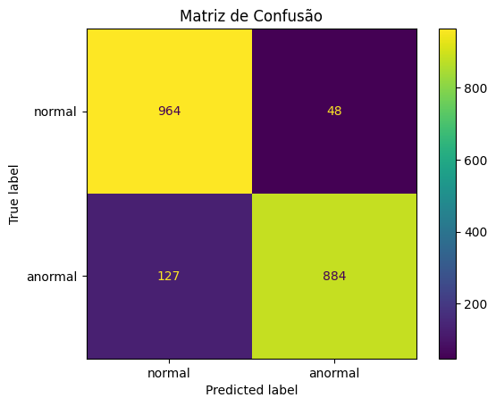

# FIAP - Faculdade de Informática e Administração Paulista

<p align="center">
  <a href="https://www.fiap.com.br/">
    
  </a>
</p>

<br>


## Grupo 34

## 👨‍🎓 Integrantes: 
- <a href="https://www.linkedin.com/in/vittor-augusto/">Vitor Augusto Gomes</a>
- <a href="https://www.linkedin.com/in/jo%C3%A3o-vitor-lopes-beiro-59a007248/">João Vitor Lopes Beiro</a>

## 👩‍🏫 Professores:
### Tutor(a) 
- <a href="https://www.linkedin.com/in/leonardoorabona/">Leonardo Ruiz Orabona</a>
### Coordenador(a)
- <a href="https://www.linkedin.com/in/profandregodoi/">André Godoi Chiovato</a>


## 📜 Descrição


# 🫀 CardioIA – Fase 2: Ir Além 2 – Diagnóstico visual em cardiologia com MLP

Este projeto aplica uma **Rede Neural Artificial (MLP – Perceptron Multicamadas)** para classificar imagens médicas de **eletrocardiogramas (ECG)** em **normal** ou **anormal**.  

Ele faz parte do desafio *CardioIA*, ampliando o uso da Inteligência Artificial para diagnósticos visuais e reforçando o papel da IA no apoio à decisão médica.

---

## 📊 Dataset

- **Fonte:** [Kaggle – Heartbeat Dataset](https://www.kaggle.com/datasets/shayanfazeli/heartbeat)  
- Classes:  
  - **Normal** → ECGs saudáveis  
  - **Anormal** → ECGs com irregularidades  

O dataset foi balanceado para conter o mesmo número de amostras normais e anormais.

---

## ⚙️ Etapas do Projeto

1. **Pré-processamento das imagens**
   - Conversão para tons de cinza
   - Redimensionamento para 128x128 pixels
   - Normalização para valores entre 0 e 1  

2. **Construção do modelo MLP (Keras)**
   - Camada de entrada (Flatten)  
   - Camadas densas ocultas com ReLU e Dropout  
   - Camada de saída com ativação Sigmoid  

3. **Treinamento**
   - Função de perda: `binary_crossentropy`  
   - Otimizador: `adam`  
   - Early Stopping para evitar overfitting  

4. **Avaliação**
   - Métricas: Acurácia, Precisão, Recall, F1-score  
   - Matriz de confusão  

---

## 📈 Resultados

- **Acurácia no conjunto de teste:** ~91%  
- **Relatório de classificação:**

```
          precision    recall  f1-score   support

  normal       0.88      0.95      0.92      1012
 anormal       0.95      0.87      0.91      1011

accuracy                           0.91      2023
```

<br>
macro avg 0.92 0.91 0.91 2023

weighted avg 0.92 0.91 0.91 2023
<br><br>

**Matriz de Confusão:**

|               | Pred Normal | Pred Anormal |
|---------------|-------------|--------------|
| **True Normal**   | 964         | 48           |
| **True Anormal**  | 127         | 884          |




---

## ▶️ Demonstração em Vídeo

📹 [Clique aqui para assistir no YouTube](COLOQUE_AQUI_O_LINK_NAO_LISTADO)  

---

## 📂 Estrutura do Repositório


